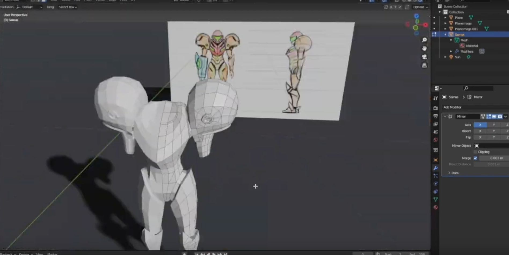
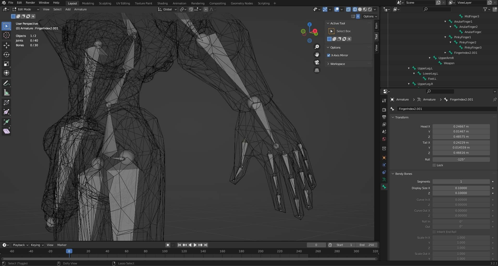
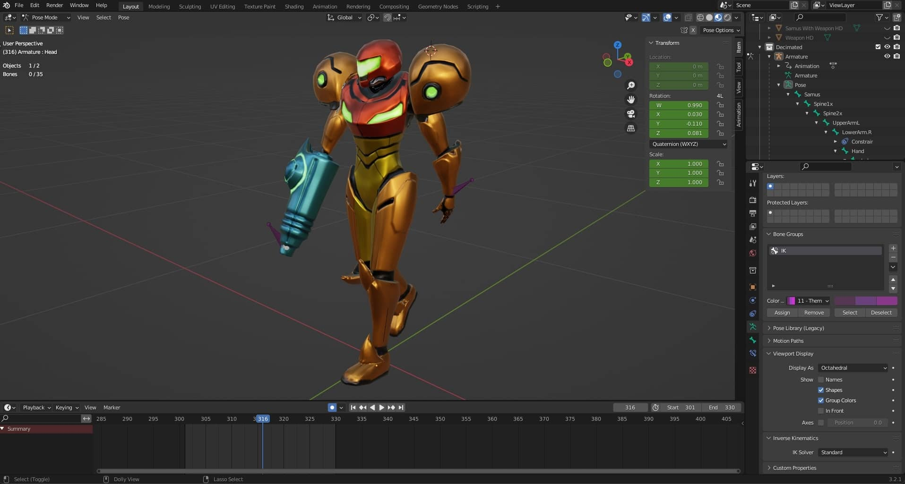
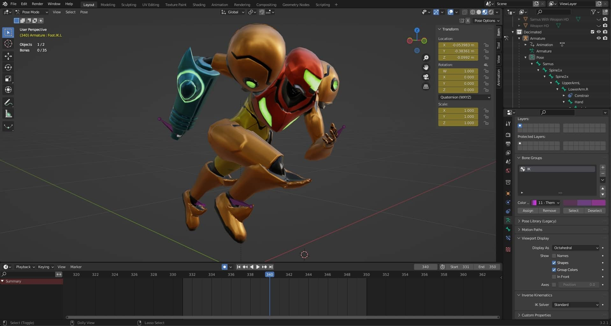

# 3D Animated Character in Unity/Blender

Modelled, Textured and Animated in Blender, later setup in **Unity 2021.3.10f1**

## Screenshots

https://user-images.githubusercontent.com/4588601/201392755-649174f8-b860-4351-8a46-1fa4afa9540f.mp4

### Resources

- [How To Make A 3D Character For Your Game](https://www.youtube.com/watch?v=ogz-3r0EHKM)
- [Baking a Normal Map](https://www.youtube.com/watch?v=tndUB5b4STI)
- [Baking Normals Low/High Poly](https://www.reddit.com/r/learnblender/comments/gbgvla/does_having_the_high_poly_object_being_completely/)
- [Blender/Unity Smooth Shading Compatibility](https://www.reddit.com/r/Unity3D/comments/47lska/just_found_out_that_blenders_smooth_shading_will/)
- [3D Scifi Kit Starter Kit](https://assetstore.unity.com/packages/3d/environments/3d-scifi-kit-starter-kit-92152)
- [Ambient Occlusion in Blender](https://docs.blender.org/manual/en/2.79/render/blender_render/world/ambient_occlusion.html)
- [Adding Vertices to Vertex Groups](https://blender.stackexchange.com/questions/183463/how-do-i-fix-vertices-that-arent-following-the-armature)
- [Inverse Kinematics - Blender 2.80 Fundamentals](https://www.youtube.com/watch?v=S-2v_CKmVE8)
- [Third Person Character Controller](https://assetstore.unity.com/packages/essentials/starter-assets-third-person-character-controller-196526)
- [Unity Input System](https://forum.unity.com/threads/new-input-system-triggers-action-on-press-and-release.1161764/)

## Table of Content

- [3D Animated Character in Unity/Blender](#3d-animated-character-in-unityblender)
  - [Screenshots](#screenshots)
    - [Resources](#resources)
  - [Table of Content](#table-of-content)
  - [Implementation](#implementation)
    - [3D Modelling](#3d-modelling)
    - [Normal Mapping](#normal-mapping)
    - [Texturing](#texturing)
    - [Importing model into Unity](#importing-model-into-unity)
    - [Rigging](#rigging)
    - [Inverse Kinematics](#inverse-kinematics)
    - [Animation](#animation)
      - [Idle Animation](#idle-animation)
      - [Walking Animation](#walking-animation)
      - [Running Animation](#running-animation)
      - [Fight Combo Animation](#fight-combo-animation)
      - [Level Up Animation](#level-up-animation)
      - [Fighting Stance Animation](#fighting-stance-animation)
    - [Importing Animations into Unity](#importing-animations-into-unity)
    - [3rd Person Character Controller](#3rd-person-character-controller)
      - [Input System](#input-system)
      - [Animator Controller](#animator-controller)

## Implementation

### 3D Modelling

- Design the character in a design software like Affinity.

- Model a low poly version.

- Subdivide and add more details, to generate a high resolution version.

- UV Map the high resolution version using Seams.

- Decimate to get a low poly again, with aligned UVs.

- Use Subdivision Catmul-Clark to get an Ultra HD to bake normals.

### Normal Mapping

- Set Smooth Shading to both the low poly and high poly models.
- Modify the models as needed to minimize meshes being too close together (like shoulders).

- Be sure both models are superposed, bake the normals making sure the extrusion is set to minimum, and the max ray distance is 0.

### Texturing

- Texture the low poly model while using the normal map.

### Importing model into Unity

- Import in Unity as FBX, without calculating smoothness for normals, just import the normals interpolation from the fbx.

- Setup a scene with a skybox and tweak the lighting to emulate the looks from Blender.

- Setup an emissive texture for the glowing parts of the suit.

### Rigging

- Create an Armature, starting from the base of the spine.
- Use Subdivision to split a bone in two connected bones.
- Use extrusion to grow a branch bone.
- Parent bones with offset to make them nested but not connected.
- Name bones `Leg.L` to be able to use `Symmetrize` to obtain a mirrored `Leg.R` across the X axis.
- Turn on `X Axis Mirror` to be able to work with both sides of the bones at the same time.

- Use the Weight Paint tool to define the influence of the bones on the vertices.

- Ensure all vertex groups are correctly delimited, to avoid unwanted weird movements.
- Make all vertices belong to at least one vertex group, otherwise they will ignore the armature movement.

- Separate the shoulders bones for better control of the animation.

### Inverse Kinematics

- Add anchor bones to setup the Inverse Kinematics for the feet and hands.
- Add the bone constraint for inverse kinematics, pointing to these bones.
- Use IK for simplifying the complex movements in the animations.

### Animation

- Place keyframes for the bones in the armature.
- Use the record function to record new movements for the bones.
- The graph editor allows to control the easing of the animation.

#### Idle Animation

- A slow animation showing the character while idle, it includes a weigh shift between the legs, and the head looking towards the distance.

#### Walking Animation

- A full walking cycle, with torso movement included.

#### Running Animation

- A full running cycle, with torso movement included.

#### Fight Combo Animation

- A full martial arts combo with fist punches, uppercut, and leg movements.

#### Level Up Animation

- Levitation animation for level ups.

#### Fighting Stance Animation

- Used to transition after finishing an attack, to avoid going to the idle animation directly.
- After finishing an attack, if a certain amount of time passes without performing any other attack, the character will transition to the idle animation.
- Walking and running also trigger this fighting stance state.

### Importing Animations into Unity

- Select the armature and its children objects in Blender, and export as fbx.
- In Unity, go to the Animations Tab and cut out the animations needed.
- Setup an animatior controller to apply the animation.

- Setup animation events.

### 3rd Person Character Controller

- Use the Third Person Character controller asset.

#### Input System

- Expand the input asset to allow melee attacks.

#### Animator Controller

- Expand the animator controller to include the melee attacks and chained attacks.
- Use a blend tree for the idle, walk and run animations.

